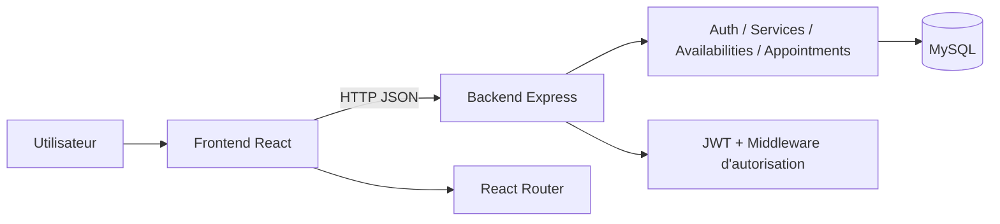
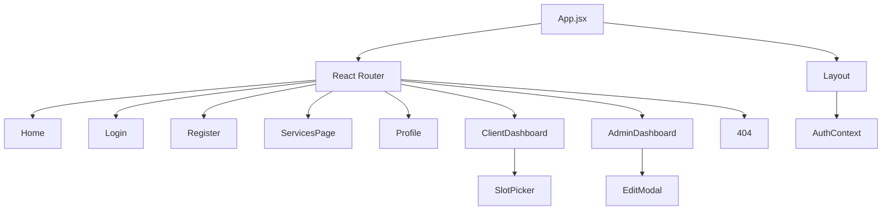
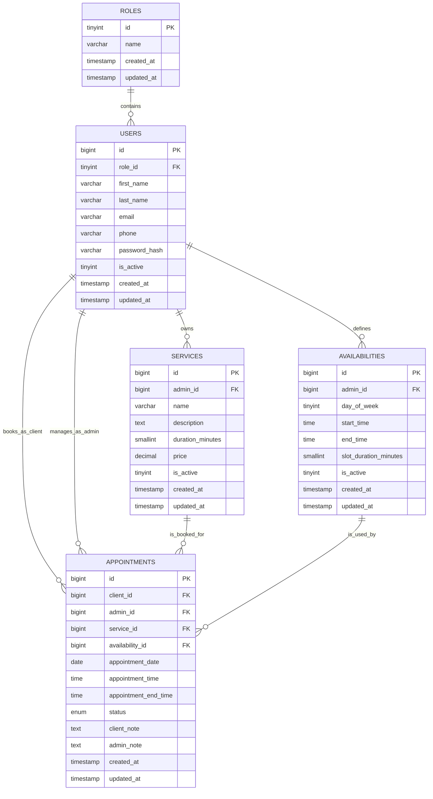
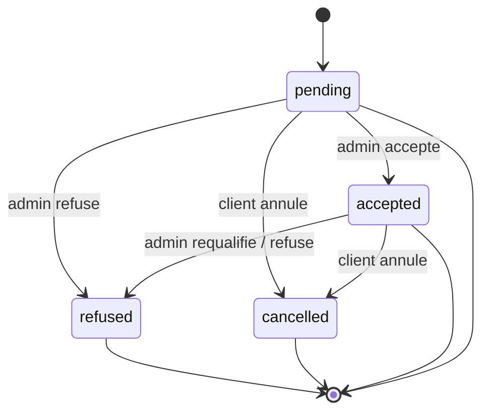
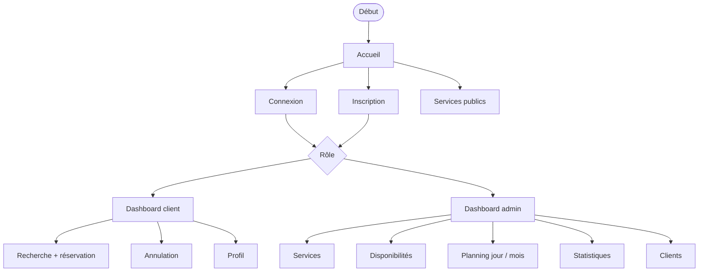
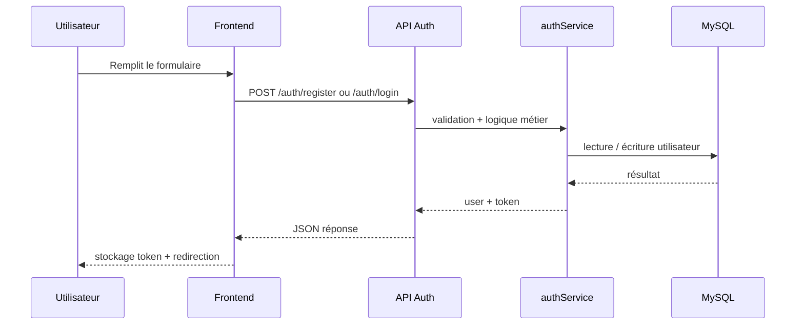
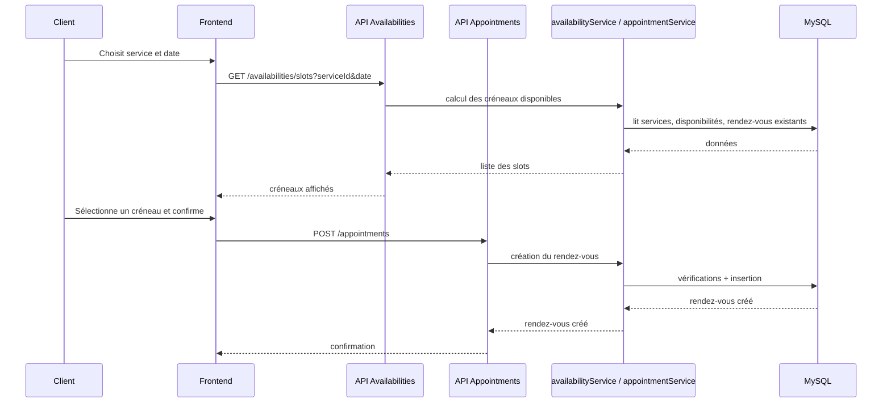
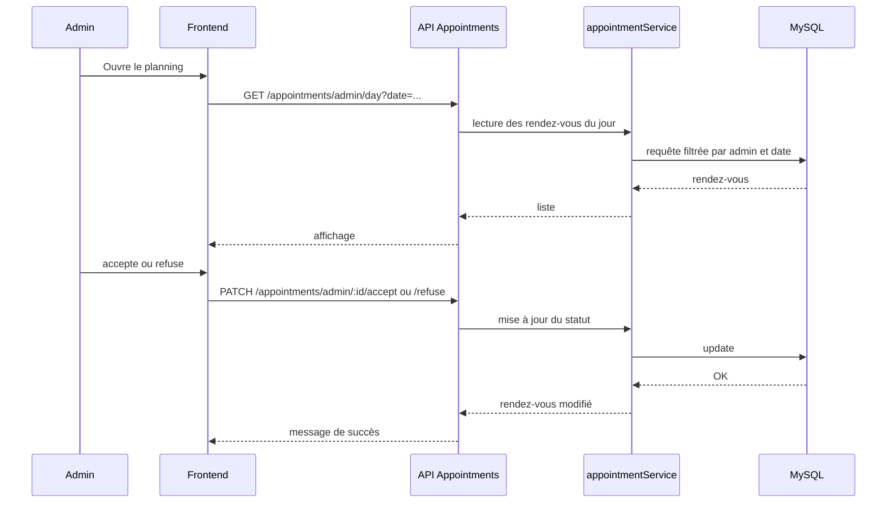
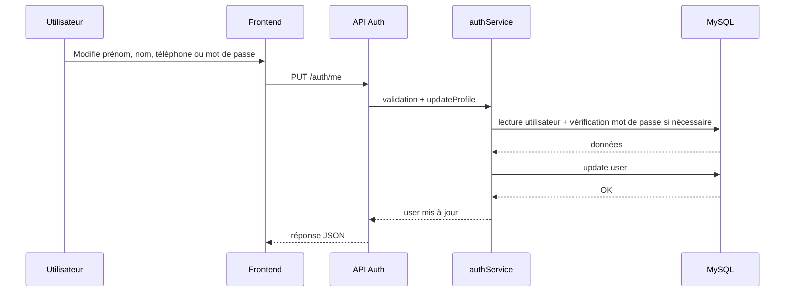

# Rapport complet SmartBooking

## 1. Vue d'ensemble

SmartBooking est une application web de prise de rendez-vous en ligne construite avec un frontend React, un backend Node.js/Express et une base MySQL.

L'application couvre les cas d'usage principaux suivants:

- Inscription et connexion de deux profils: client et administrateur.
- Consultation publique des services.
- Recherche de créneaux disponibles à partir d'une date et d'un service.
- Réservation, annulation et suivi des rendez-vous côté client.
- Création et gestion des services, disponibilités, rendez-vous et statistiques côté administrateur.
- Mise à jour du profil utilisateur.
- Navigation avec fallback 404.

Validation actuelle du projet:

- Le backend passe les tests unitaires ajoutés.
- Le frontend compile en build de production.

## 2. Stack technique

- Frontend: React 18, React Router, Vite.
- Backend: Node.js, Express, bcryptjs, jsonwebtoken, mysql2, express-rate-limit, helmet, cors, morgan.
- Base de données: MySQL / InnoDB.
- Validation: schémas locaux côté backend via middleware `validate`.
- Tests backend: `node --test`.

## 3. Structure du projet

```text
README.md
backend/
  package.json
  src/
    app.js
    server.js
    config/
    controllers/
    middlewares/
    routes/
    scripts/
    services/
    utils/
    validators/
  test/
database/
  schema.sql
frontend/
  package.json
  vite.config.js
  src/
    App.jsx
    main.jsx
    api/
    components/
    context/
    pages/
    styles/
```

## 4. Architecture globale



Le frontend gère l'interface, l'authentification visuelle et les pages métier. Le backend expose une API REST JSON sécurisée par JWT. La base MySQL applique les contraintes de cohérence métier les plus importantes.

## 5. Architecture frontend



### Rôle des principaux composants frontend

- `App.jsx`: déclare les routes et les protections d'accès.
- `Layout.jsx`: barre de navigation commune et structure de page.
- `ProtectedRoute.jsx`: bloque l'accès si l'utilisateur n'est pas authentifié ou n'a pas le bon rôle.
- `AuthContext.jsx`: stocke `user`, `loading`, `login`, `register`, `updateProfile`, `logout`.
- `SlotPicker.jsx`: affichage des créneaux disponibles.
- `EditModal.jsx`: édition modale des services et disponibilités côté admin.
- `Profile.jsx`: édition du profil et du mot de passe.
- `NotFound.jsx`: fallback 404.

## 6. Architecture backend

```mermaid
flowchart TD
  Server[server.js] --> App[app.js]
  App --> Middleware[helmet / cors / json / morgan / rateLimit]
  App --> Router[Routes API]
  Router --> AuthR[/auth]
  Router --> ServicesR[/services]
  Router --> AvailR[/availabilities]
  Router --> ApptR[/appointments]
  AuthR --> AuthCtrl[authController]
  ServicesR --> ServiceCtrl[serviceController]
  AvailR --> AvailCtrl[availabilityController]
  ApptR --> ApptCtrl[appointmentController]
  AuthCtrl --> AuthSvc[authService]
  ServiceCtrl --> ServiceSvc[serviceService]
  AvailCtrl --> AvailSvc[availabilityService]
  ApptCtrl --> ApptSvc[appointmentService]
  AuthSvc --> DB[(MySQL)]
  ServiceSvc --> DB
  AvailSvc --> DB
  ApptSvc --> DB
```

### Couche backend

- `config/env.js`: lecture des variables d'environnement.
- `config/db.js`: pool MySQL.
- `middlewares/auth.js`: vérification JWT et rôle.
- `middlewares/validate.js`: validation des entrées.
- `controllers/*`: adaptation HTTP -> service.
- `services/*`: logique métier principale.
- `utils/*`: erreurs, temps, JWT, handlers.

## 7. Modèle de données



### Règles de cohérence portées par le schéma

- Une adresse email ne peut exister qu'une seule fois.
- Un service appartient à un administrateur.
- Une disponibilité appartient à un administrateur.
- Un rendez-vous relie un client, un administrateur, un service et une disponibilité.
- Le schéma empêche certaines collisions de réservation via des contraintes d'unicité.

## 8. Diagramme d'état des rendez-vous



### Interprétation métier

- `pending`: rendez-vous créé mais non traité.
- `accepted`: rendez-vous validé par l'administrateur.
- `refused`: rendez-vous refusé par l'administrateur.
- `cancelled`: rendez-vous annulé par le client.

## 9. Parcours utilisateur principal



## 10. Séquence: inscription et connexion



### Détails techniques

- Le frontend envoie un JSON.
- Le backend valide les champs avant d’appeler les services.
- Le mot de passe est haché avec `bcryptjs`.
- Le JWT est signé côté backend et stocké dans `localStorage` côté frontend.

## 11. Séquence: recherche et création d'un rendez-vous



### Règles métier pour la réservation

- Le service doit être actif.
- Le créneau doit appartenir à une disponibilité active de l'administrateur.
- Le rendez-vous doit tenir dans la fenêtre horaire.
- Les chevauchements sont refusés.
- Les collisions sur la date et l'heure sont évitées par contrôle applicatif et contraintes SQL.

## 12. Séquence: gestion admin d'un rendez-vous



## 13. Séquence: mise à jour du profil



## 14. Routes API

### Auth

- `POST /api/auth/register`: inscription.
- `POST /api/auth/login`: connexion.
- `GET /api/auth/me`: profil courant.
- `PUT /api/auth/me`: mise à jour du profil.

### Services

- `GET /api/services`: services publics.
- `GET /api/services/admin`: services de l’administrateur connecté.
- `POST /api/services/admin`: création.
- `PUT /api/services/admin/:id`: mise à jour.
- `DELETE /api/services/admin/:id`: suppression.

### Disponibilités

- `GET /api/availabilities`: disponibilités administrateur.
- `GET /api/availabilities/slots`: créneaux calculés pour un service et une date.
- `POST /api/availabilities/admin`: création.
- `PUT /api/availabilities/admin/:id`: mise à jour.
- `DELETE /api/availabilities/admin/:id`: suppression.

### Rendez-vous

- `POST /api/appointments`: création d’un rendez-vous client.
- `GET /api/appointments/my`: rendez-vous du client.
- `PATCH /api/appointments/:id/cancel`: annulation côté client.
- `GET /api/appointments/admin/day`: planning journalier.
- `GET /api/appointments/admin/month`: planning mensuel.
- `PATCH /api/appointments/admin/:id/accept`: acceptation.
- `PATCH /api/appointments/admin/:id/refuse`: refus.
- `GET /api/appointments/admin/statistics`: statistiques.
- `GET /api/appointments/admin/clients`: liste clients.

## 15. Pages frontend

| Page | Rôle |
|---|---|
| `/` | Accueil et présentation |
| `/login` | Connexion |
| `/register` | Inscription |
| `/services` | Catalogue public |
| `/profile` | Profil utilisateur |
| `/client` | Tableau de bord client |
| `/admin` | Tableau de bord administrateur |
| `*` | Fallback 404 |

## 16. Comportements par page

### Accueil

- Présente le produit.
- Oriente vers inscription et connexion.

### Catalogue public

- Charge les services actifs.
- Affiche le nom du service, la description, la durée et le prix.

### Connexion / inscription

- Gèrent les rôles `client` et `admin`.
- Utilisent le token JWT retourné par l’API.
- Redirigent vers le bon espace selon le rôle.

### Profil

- Permet de modifier prénom, nom, téléphone et mot de passe.
- Ne permet pas la modification directe de l’email.

### Dashboard client

- Réservation avec service, date, créneau et note.
- Liste des rendez-vous.
- Annulation des rendez-vous autorisés.
- Notifications simplifiées.
- Filtre de statut et pagination.

### Dashboard admin

- Création / édition / suppression de services.
- Création / édition / suppression de disponibilités.
- Planning journalier et mensuel.
- Acceptation / refus des rendez-vous.
- Statistiques et liste des clients.
- Filtre par statut, recherche clients et pagination.

## 17. Validation et sécurité

### Sécurité backend

- `helmet` protège les en-têtes HTTP.
- `cors` limite l’origine autorisée.
- `express-rate-limit` réduit le risque de brute force.
- JWT obligatoire pour les routes privées.
- Vérification des rôles `client` et `admin`.
- Requêtes SQL paramétrées via `mysql2`.

### Validation des entrées

- Contrôle du format email.
- Longueur minimale des noms et mots de passe.
- Validation du rôle.
- Validation du mot de passe actuel lors d’un changement de mot de passe.
- Contraintes de base côté frontend via `minLength`, `maxLength`, `pattern`, `min`.

## 18. Logique métier importante

- Un client peut réserver uniquement sur des créneaux générés par une disponibilité active.
- Les créneaux sont calculés à partir de la durée du service et du pas de créneau de l’administrateur.
- Les rendez-vous ne peuvent pas se chevaucher côté admin.
- Le client peut annuler un rendez-vous tant qu’il est en attente ou accepté.
- L’administrateur peut accepter ou refuser un rendez-vous en attente.
- Un mot de passe ne peut être changé qu’avec le mot de passe actuel.

## 19. Données de démonstration

Le script de seed crée:

- Un administrateur de démonstration.
- Un client de démonstration.
- Un service actif.
- Des disponibilités de base.

Comptes prévus dans le projet:

- Admin: `admin@smartbooking.local` / `Password123!`
- Client: `client@smartbooking.local` / `Password123!`

## 20. Fichiers clés à consulter

- [README.md](README.md)
- [database/schema.sql](database/schema.sql)
- [backend/src/app.js](backend/src/app.js)
- [backend/src/routes/index.js](backend/src/routes/index.js)
- [backend/src/services/authService.js](backend/src/services/authService.js)
- [backend/src/services/appointmentService.js](backend/src/services/appointmentService.js)
- [backend/src/services/availabilityService.js](backend/src/services/availabilityService.js)
- [frontend/src/App.jsx](frontend/src/App.jsx)
- [frontend/src/context/AuthContext.jsx](frontend/src/context/AuthContext.jsx)
- [frontend/src/pages/ClientDashboard.jsx](frontend/src/pages/ClientDashboard.jsx)
- [frontend/src/pages/AdminDashboard.jsx](frontend/src/pages/AdminDashboard.jsx)

## 21. État actuel du projet

### Fonctionnellement présent

- Authentification.
- Gestion de profil.
- Catalogue de services.
- Calcul des créneaux.
- Réservation client.
- Gestion admin des services et disponibilités.
- Gestion des rendez-vous.
- Statistiques et liste clients.

### Compléments encore possibles

- Notification email/SMS réelle.
- Export PDF ou CSV.
- Historique plus détaillé par utilisateur.
- Recherche avancée sur les services et les rendez-vous.
- Journal d’audit côté admin.
- Pagination serveur pour les gros volumes.

## 22. Conclusion

SmartBooking est une base solide de plateforme de rendez-vous avec un socle fonctionnel cohérent entre le frontend, le backend et la base de données. L’application est déjà structurée pour la réservation, la gestion des disponibilités et l’administration. Le prochain niveau naturel consiste à renforcer les notifications, l’observabilité, l’export de données et la pagination serveur.
